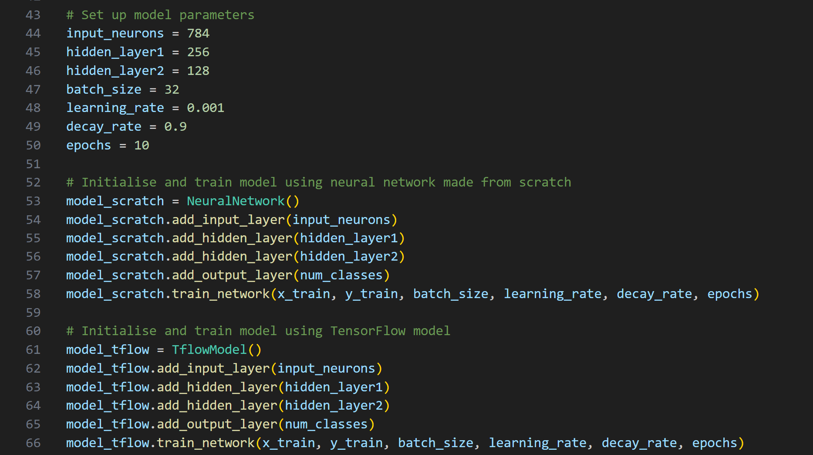

# Predicting MNIST Digits

This project showcases a custom implementation of a neural network built from scratch (using only NumPy) in Python, focusing on its performance comparison with an equivalent TensorFlow model on the MNIST dataset. The goal is to understand the fundamentals of a neural network whilst achieving a high-level of performance dictated by various metrics.

## Installation

This script requires Python 3 and the following dependencies:

- Keras (import MNIST dataset)
- Matplotlib (plotting results)
- NumPy (manipulating arrays and apply mathematical operations)
- Os-sys (create new file directories and save outputs)
- Scikit-learn (model evaluation and performance metrics)
- TensorFlow (build and train neural network)
- Tqdm (monitor training progress)

```bash
pip install keras
pip install matplotlib
pip install numpy
pip install os-sys
pip install scikit-learn
pip install tensorflow
pip install tdqm
```
    
## Usage

To view the project, follow these steps:
- Clone the repository or download a zip file containing the scripts.
- Ensure you have installed the required dependencies.
- Run the main.py script directly within your IDE of choice or in the command-line interface:
```bash
python main.py
```
- If you would like to modify the number of layers in the network or other model parameters, you can do so within the main.py script as shown below:


## Model Overview

For a fair comparison, both models share the same architecture:

**Neural Network Configuration**
   - An input layer containing 784 neurons for each of the image pixels in the MNIST dataset (28 x 28).
   - First hidden layer contains 256 neurons (ReLU activation function).
   - Second hidden layer contains 128 neurons (ReLU activation function).
   - Output layer contain 10 neurons to represent the probabilities for each of the digit classes (Softmax activation function).

**Initialisers**
   - Weights are initialised using the Glorot approach.
   - Biases are intiailised as zeros.

**Loss**
   - Categorical Cross-Entropy for multi-classification.

**Optimiser**
   - RMSProp with "cached" weights and biases that update with each batch.
   - Learning rate of 0.001.
   - Decay rate of 0.9.

**Other Model Parameters**
   - Models were trained for 10 epochs each.
   - Batch-size of 32.
   - 60,000 training images from the MNIST dataset.

## Results
Both models achieved very high accuracies on the test set comprised of 10,000 images:
- Model from scratch: **97.28%**
- TensorFlow: **97.99%**

Whilst both models were quite comparable in terms of their performance, the latter slightly edged out the former across most evaluation metrics (found within the metrics folder). Further work includes investigating the TensorFlow Sequential model source code and comparing it to the custom implementation to understand any disparities in the logic.
